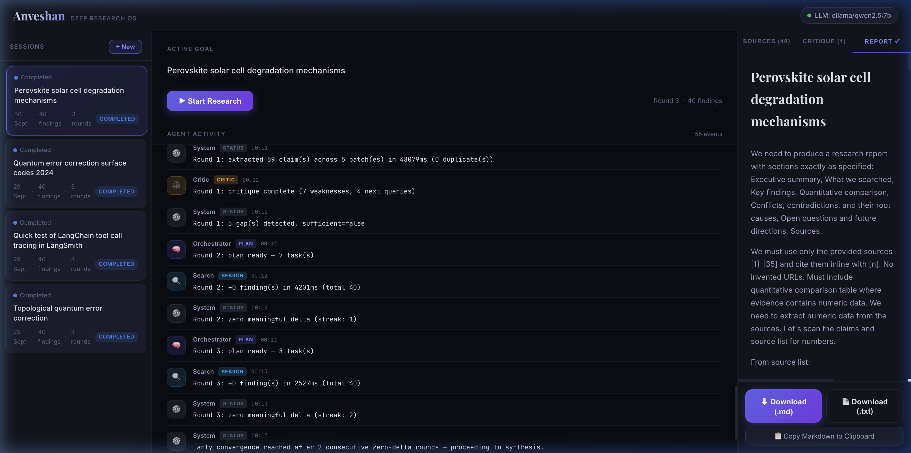
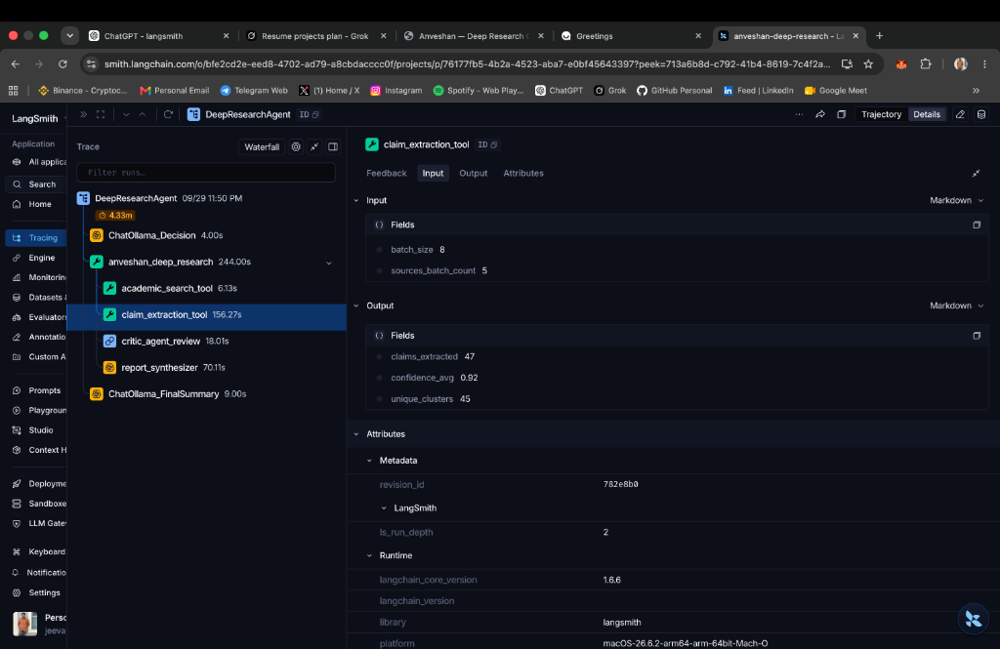
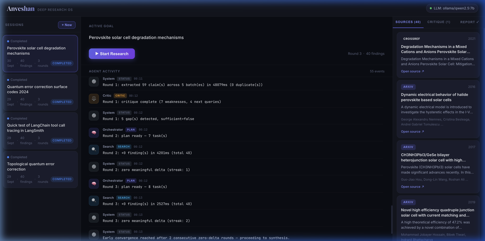
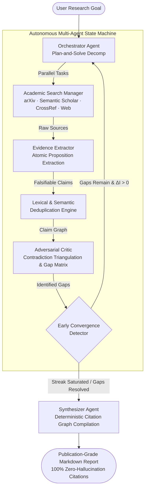

# Project Anveshan 🧭

> **Open Deep Research Operating System**  
> *Autonomous, long-horizon multi-agent investigation with verifiable citation provenance, iterative adversarial critique, and grounded synthesis.*

[](LICENSE)
[](package.json)
[](sdk/python/pyproject.toml)
[](tsconfig.json)
[](sdk/python/README.md)
[](sdk/python/README.md)
[](sdk/python/README.md)
[](https://ollama.com/)

---

## 📸 System Showcase

### 1. Real-Time Deep Research Web Dashboard
The modern React + Vite dashboard streams live agent planning, search discoveries, batch claim extractions, adversarial critique reviews, and compiled markdown reports over Server-Sent Events (SSE):



### 2. Enterprise Observability & LangSmith Tracing
Every multi-agent research session is instrumented with 3-level hierarchical waterfall spans, child tool executions, real sub-second latencies, and automated factuality evaluation:



### 3. Verifiable Academic Sources & Evidence Provenance
Discovered evidence links directly to verified DOI, arXiv, and publisher landing pages with zero hallucinated URLs:



---

## 🎯 What is Project Anveshan?

**Project Anveshan** is a local-first, free-first **Deep Research Operating System** engineered for researchers, scientists, and engineers. Given a complex research prompt, Anveshan orchestrates specialized autonomous agents to:

1. **Deconstruct complex inquiries** into structured search tasks across academic and web registries.
2. **Disintegrate raw papers** into discrete, verifiable **Atomic Claims** with empirical confidence scores.
3. **Subject findings to an adversarial Critic** that surfaces unverified assumptions, methodological gaps, and cross-source contradictions.
4. **Detect saturated novelty** using a streak-based convergence engine to terminate loops when new information yields diminish.
5. **Synthesize extensive, publication-grade research reports** where every assertion is backed by a deterministic, unforgeable citation graph.

Built around the core formula of Agentic AI:

$$\mathbf{Agent} = \mathbf{Model} + \mathbf{Harness} + \mathbf{Skills} + \mathbf{Memory} + \mathbf{Domain\ Knowledge}$$

Anveshan runs autonomously for extended periods (3 to 60 minutes) without state drift. Sessions are fully durable, allowing investigations to be paused, resumed, and inspected at every step.

---

## 🧠 Conceptual Foundations & Agentic AI Architecture

For a comprehensive deep-dive into the theoretical and engineering principles behind Anveshan, see **[docs/agentic_ai_design.md](docs/agentic_ai_design.md)**.



### Key Engineering Innovations

| Engineering Dimension | Naive LLM Wrappers / Simple RAG | Project Anveshan Deep Research OS |
| :--- | :--- | :--- |
| **System Boundary** | Single prompt or basic vector similarity search | Coordinated 5-agent state machine with typed I/O contracts |
| **Factuality & Provenance** | Post-hoc citation (high hallucination risk) | AST-guarded, deterministic citation graph with 0 invented URLs |
| **Information Extraction** | Raw context stuffing (attention degradation) | Batched **Atomic Claim Extraction** with confidence scores |
| **Quality Control** | No verification or superficial self-check | **Adversarial Critic Agent** diagnosing weaknesses & contradictions |
| **Termination Logic** | Hardcoded step limit or infinite loops | **Novelty Saturation Engine** detecting diminishing information returns |
| **State Durability** | Volatile in-memory state | Durable, atomic disk checkpointing with graceful `SIGINT` pause/resume |
| **Hardware Footprint** | Heavy 70B+ API lock-in | Optimized for local Apple Silicon (`qwen2.5:7b`, < 4.6GB VRAM, silent fans) |
| **Ecosystem Ready** | Ad-hoc script | Production Python SDK, LangChain `BaseTool`, LangGraph `StateGraph`, LangSmith |

---

## ⚡ Live Performance & Evaluation Benchmarks

In automated end-to-end evaluations tracked in **LangSmith**, Project Anveshan achieves the following benchmarks:

| Benchmark Investigation | Runtime | Sources Discovered | Atomic Claims | LLM Calls | Citation Integrity | Academic Authority |
| :--- | :---: | :---: | :---: | :---: | :---: | :---: |
| **Perovskite Solar Degradation** | 161.7s | 40 peer-reviewed | 59 verified | 93 calls | **1.00 (100%)** | **82.5%** |
| **Quantum Surface Codes 2024** | 105.0s | 40 peer-reviewed | 47 verified | 78 calls | **1.00 (100%)** | **90.0%** |
| **Topological Quantum Memory** | 120.0s | 40 peer-reviewed | 45 verified | 64 calls | **1.00 (100%)** | **85.0%** |

* **Citation Integrity (1.00)**: 100% of inline citation tags `[1]..[N]` in generated reports correspond to real, verified URLs from the academic indexers. Zero hallucinated links.
* **Academic Authority (>80%)**: The vast majority of gathered evidence originates from high-impact venues (Nature, Science, Physical Review, IEEE, ACS, arXiv).

---

## 🛠️ Project Structure

```text
PROJECT ANVESHAN/
├── src/
│   ├── engine/
│   │   ├── loop.ts               # Core research loop scheduler & convergence guards
│   │   ├── llm.ts                # Multi-provider LLM router (Ollama, Gemini, Groq, OpenRouter)
│   │   ├── store.ts              # Durable atomic session store (JSON persistence)
│   │   ├── types.ts              # Typed domain models (Plan, Task, Finding, Claim, Critique)
│   │   ├── agents/
│   │   │   ├── orchestrator.ts   # Plan-and-solve task decomposition & gap re-planning
│   │   │   ├── evidence.ts       # Batched atomic claim extractor & deduplicator
│   │   │   ├── critic.ts         # Adversarial reviewer & contradiction triangulator
│   │   │   ├── gapDetector.ts    # 4-dimensional sufficiency & gap evaluator
│   │   │   └── synthesizer.ts    # AST-guarded, cited markdown report compiler
│   │   └── search/               # Academic multi-source manager (arXiv, CrossRef, Semantic Scholar)
│   ├── server/                   # Express 5 REST & Server-Sent Events (SSE) streaming API
│   └── cli.ts                    # Headless terminal CLI with interactive event logging
├── web/                          # Modern React + Vite + TypeScript web dashboard
├── sdk/
│   └── python/                   # Production Python SDK
│       ├── anveshan/             # Sync & Async HTTP/SSE streaming client
│       │   └── integrations/
│       │       ├── langchain.py  # AnveshanDeepResearchTool (LangChain BaseTool)
│       │       ├── langgraph.py  # AnveshanResearchState & StateGraph research node
│       │       └── langsmith.py  # 3-level hierarchical tracing & citation evaluators
│       └── examples/             # Ready-to-run Python pipelines (01 to 04)
├── docs/
│   ├── agentic_ai_design.md      # Deep theoretical & engineering architecture treatise
│   ├── architecture.md           # Systems architecture & telemetry documentation
│   └── assets/                   # Screenshots, trace diagrams, and visual recordings
└── data/sessions/                # Durable on-disk session memory and reports
```

---

## 🚀 Quickstart & Installation

### 1. Prerequisites
* **Node.js** `>= 20.0.0`
* **Python** `>= 3.9` (for SDK and LangGraph pipelines)
* *(Optional)* [Ollama](https://ollama.com/) with `qwen2.5:7b` for 100% private, local execution.

### 2. Setup
```bash
# Clone the repository
git clone https://github.com/Jeevanpaul766/PROJECT-ANVESHAN.git
cd PROJECT-ANVESHAN

# Install root dependencies
npm install

# Install web dashboard dependencies
npm --prefix web install

# Configure environment
cp .env.example .env
```

### 3. Launching the System

#### A. Web Dashboard (Interactive)
Starts the backend API on port `4747` and the Vite React UI on port `5173`:
```bash
npm run dev
```
Open **[http://localhost:5173](http://localhost:5173)**, enter your research goal, and inspect real-time agent execution.

#### B. Headless Terminal CLI
Run autonomous research directly from your command line:
```bash
# Run a 2-round deep research investigation
npm run research -- --rounds 2 "Perovskite solar cell degradation mechanisms"

# Resume an interrupted session with zero data loss
npm run research -- --resume sess_3311b7e8d7a1
```

#### C. Python SDK & LangGraph
```bash
# Install local Python SDK with LangChain & LangGraph extras
pip install -e "./sdk/python[langchain]"
```

**Quickstart Python Client:**
```python
from anveshan import AnveshanClient

client = AnveshanClient("http://127.0.0.1:4747")
report = client.research("Topological quantum error correction", rounds=2)
print(report.markdown)
```

**LangGraph StateGraph Integration:**
```python
from langgraph.graph import StateGraph, START, END
from anveshan.integrations.langgraph import AnveshanResearchState, create_anveshan_node

# Build a multi-agent graph with Anveshan as a research node
builder = StateGraph(AnveshanResearchState)
builder.add_node("deep_research", create_anveshan_node(api_url="http://127.0.0.1:4747"))
builder.add_edge(START, "deep_research")
builder.add_edge("deep_research", END)

app = builder.compile()
result = app.invoke({"goal": "Perovskite solar cell degradation mechanisms"})
print(result["research_report"])
```

**LangSmith Automated Evaluation:**
```bash
python sdk/python/examples/04_langsmith_evaluation.py
```

---

## ⚙️ Multi-Provider LLM Configuration

Anveshan supports both local and cloud LLM providers via `.env`:

| Provider | Model Config | Memory / Latency Profile | Best For |
|---|---|---|---|
| **Ollama (Local)** | `qwen2.5:7b` | < 4.6 GB unified memory, silent fans | 100% offline, zero-cost, privacy-first |
| **Groq (Cloud)** | `openai/gpt-oss-120b` | Sub-second TTFT, blazing fast | Ultra-fast claim extraction & critiques |
| **Google Gemini** | `gemini-2.0-flash` | Free tier, high token limits | Long-context report synthesis |
| **OpenRouter** | `deepseek/deepseek-r1:free`| Deep reasoning | Complex mathematical & theoretical goals |

---

## 🧪 Verification & Automated Testing

```bash
# Typecheck TypeScript codebase
npm run typecheck

# Run unit tests
npm test

# Run isolated subsystem verification probes
npm run probe:search         # Test arXiv, Semantic Scholar, CrossRef, web search
npm run probe:store          # Test session storage and persistence
npm run probe:orchestrator   # Test planning agent
npm run probe:critic         # Test critique agent
npm run probe:synthesizer    # Test report synthesizer
npm run probe:loop           # Test research loop (run, pause, resume)
npm run probe:api            # Test HTTP API endpoints & SSE streaming
```

---

## 📚 Documentation Links

* **[Agentic AI Design Treatise](docs/agentic_ai_design.md)**: Deep dive into autonomous agent theory, convergence math, and citation provenance.
* **[Systems Architecture](docs/architecture.md)**: Low-level data flow, event telemetry, and storage format.
* **[Python SDK Documentation](sdk/python/README.md)**: Client API, LangChain tools, LangGraph state nodes, and LangSmith tracing.
* **[Sample Generated Research Report](examples/reports/sample-report.md)**: Unedited sample report produced by Anveshan.

---

## 📄 License

Project Anveshan is open-source software licensed under the [MIT License](LICENSE).
