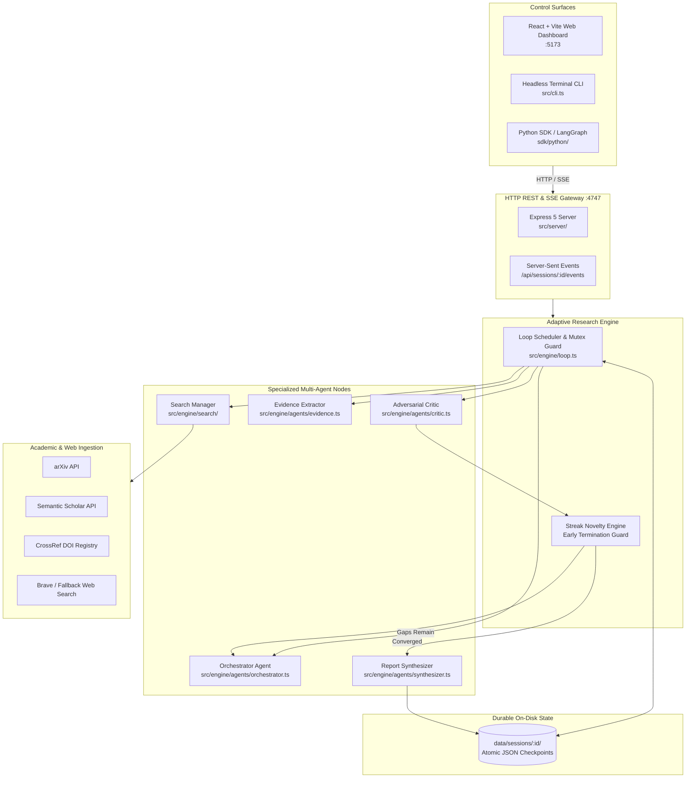
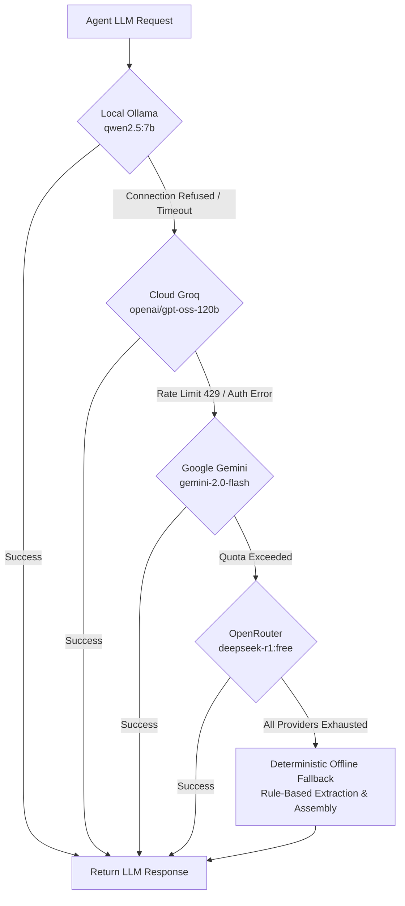

# Project Anveshan Architecture 🧭

> **Comprehensive Systems Architecture, Telemetry, and Storage Specifications**  
> *For conceptual and agentic design patterns, see [docs/agentic_ai_design.md](agentic_ai_design.md).*

---

## 1. High-Level Systems Topology

Project Anveshan separates concerns across **Control Surfaces**, an **HTTP/SSE API Gateway**, an **Adaptive Research Engine**, **Specialized Subsystem Agents**, and **Durable Storage**:



---

## 2. Core System Layers

### A. Control Surfaces
1. **Web Dashboard (`web/`)**:
   - Modern single-page application built on Vite, React 18, and TypeScript.
   - Subscribes to real-time agent lifecycle events via Server-Sent Events (`/api/sessions/:id/events`).
   - Displays real-time agent status pills, session history, source cards, adversarial critiques, and live Markdown report rendering with clipboard and download triggers.
2. **Terminal CLI (`src/cli.ts`)**:
   - Headless research runner (`npm run research -- "<goal>"`).
   - Real-time formatted console logging of agent planning, findings, and synthesis.
   - Supports `--rounds <n>`, `--resume <sessionId>`, and graceful `SIGINT` pause with atomic state persistence.
3. **Python SDK & LangGraph Node (`sdk/python/`)**:
   - Typed Pydantic v2 data models with sync and async HTTP clients.
   - Native LangChain `BaseTool` (`AnveshanDeepResearchTool`) for ReAct agents.
   - Native LangGraph StateGraph Node (`create_anveshan_node`) for multi-agent graph pipelines.
   - Full LangSmith tracing integration with automated Citation Integrity and Source Authority evaluation.

### B. HTTP & Event Telemetry Gateway (`src/server/`)
- Express 5 server bound strictly to local loopback `127.0.0.1:4747`.
- **REST Endpoints**:
  - `POST /api/sessions`: Creates an uninitialized session.
  - `POST /api/sessions/:id/start`: Launches autonomous background research immediately without blocking HTTP requests.
  - `POST /api/sessions/:id/pause`: Gracefully pauses active loop execution.
  - `GET /api/sessions`: Returns list of all historical sessions on disk.
  - `GET /api/sessions/:id`: Returns session status, metadata, and final report.
  - `GET /api/sessions/:id/events`: Opens an append-only SSE stream delivering real-time agent event payloads with keepalive heartbeats every 15 seconds.

### C. Adaptive Research Loop (`src/engine/loop.ts`)
The OS scheduler that drives the iterative multi-round pipeline:
- **Round Cycle**:
  1. `plan`: Orchestrator drafts `ResearchPlan` with discrete sub-tasks.
  2. `search`: Search Manager concurrently queries arXiv, Semantic Scholar, CrossRef, and Web.
  3. `extract`: Evidence Extractor parses raw findings into atomic propositions (8 sources per batch).
  4. `dedup`: Deduplication engine removes redundant claims based on lexical and semantic similarity.
  5. `critic`: Adversarial Critic evaluates claims, identifies weaknesses, and formulates gap matrix.
  6. `converge`: Dynamic convergence engine calculates information delta ($\Delta I$). If streak of zero new findings $\ge 2$, early convergence terminates search.
  7. `synthesize`: Synthesizer compiles verified findings and claims into an AST-guarded, cited markdown report.
- **Concurrency Guard**: Strict in-memory mutex (`activeSessionLocks`) prevents duplicate parallel runs on the same session directory.

### D. Durable On-Disk Session Memory (`src/engine/store.ts`)
Every session is an isolated on-disk folder under `data/sessions/<session-id>/`:

```text
data/sessions/<session-id>/
├── meta.json         # Session status, timestamps, model info, performance metrics
├── plan.json         # Latest structured research plan and task states
├── findings.json     # All discovered sources with full URL provenance and snippets
├── claims.json       # Extracted atomic claims, scores, and cluster references
├── critiques.json    # Round-by-round critique evaluations and identified gaps
├── events.json       # Append-only chronological audit log (capped at 500 events)
└── report.md         # Final compiled, cited markdown report
```

---

## 3. Telemetry Event Schema

All events emitted to the Web UI, CLI, and Python client follow a strict JSON schema:

```typescript
export interface ResearchEvent {
  id: string;              // Unique event UUID
  sessionId: string;       // Session identifier
  timestamp: string;       // ISO 8601 UTC timestamp
  source: "orchestrator" | "search" | "evidence" | "critic" | "synthesizer" | "system";
  kind: "status" | "plan" | "finding" | "claim" | "critique" | "synthesis" | "error";
  data: Record<string, unknown>;
  message: string;         // Human-readable log line
}
```

---

## 4. Multi-Provider LLM Router Architecture

The router in `src/engine/llm.ts` handles graceful fallback across local and cloud LLMs:



This ensures that Anveshan **never crashes or throws unhandled exceptions** due to upstream provider outages or rate limits.
